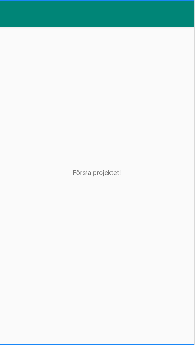

# Rapport

För denna uppgift har jag skapat ett Github konto och kopplat det till Android Studio, sedan klonade jag koden ifrån Github och lade till det till min Android Studio för att kunna redigera koden.

    <TextView
        android:layout_width="wrap_content"
        android:layout_height="wrap_content"
        android:text="Första projektet!"
        app:layout_constraintBottom_toBottomOf="parent"
        app:layout_constraintLeft_toLeftOf="parent"
        app:layout_constraintRight_toRightOf="parent"
        app:layout_constraintTop_toTopOf="parent" />

Jag redigerade sektionen "android:text" till att säga "Första Projektet!".
Bilden nedan är hur resultatet ser ut i appen.

